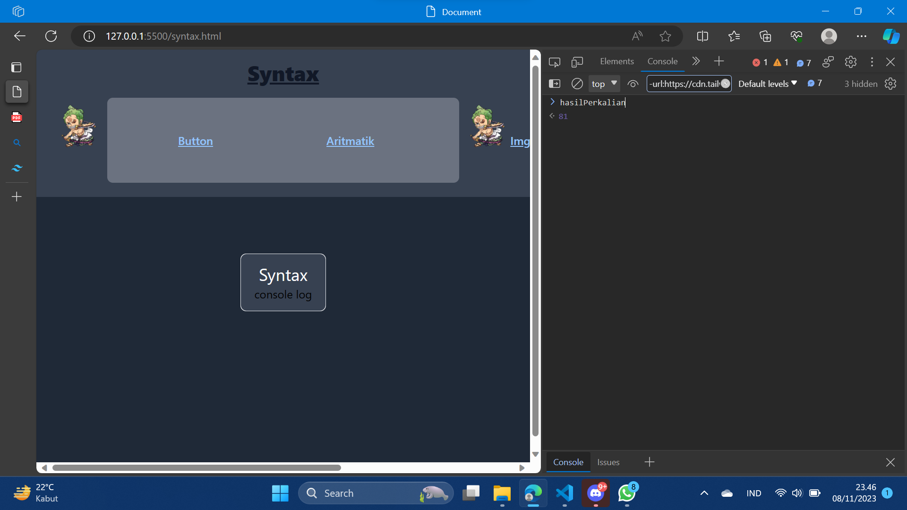

membuat web dengan html,tailwind css,dan javascript
web yang saya buat mengenai list komik yang sering saya baca
dan terdapat syntax,aritmatika,change image,paragraf,button,statement namun saya membuatnya di codingan yang berbeda
pada screenshot 1.png ada hasil dari aritmatika yang saya buat


## Aritmatika
``` js
<script>
    let x = 20;
    let y = 15;
    let z = x * y
    {document.getElementById('art').innerHTML = z}
</script>
```
## Button
``` js
<script>
    function tombolDitekan() {
    alert('Tombol ditekan!');
}
</script>
```
## Syntax
``` js
<script>
    let angka1 = 9;
    let angka2 = 9;
    let hasilPerkalian = angka1 * angka2;
    console.log("Hasilnya adalah " + angka1 * angka2);
</script>

```
## Statement
```js
<script>
let x, y, z;
x = 50;       
y = 70;       
z = x + y;    

document.getElementById("stm").innerHTML =
"value z adalah " + z + ".";  
</script>
```
## Image Change & Paragraf
```js
<section class="flex">
                <button type="button" onclick="getElementById('lah').src = 'img/b.jpg'"></button>
                <button type="button" onclick="getElementById('loh').src = 'img/b.jpg'"></button>
                <button type="button" onclick="getElementById('leh').src = 'img/b.jpg'"></button>
                <button type="button" onclick="getElementById('lih').src = 'img/b.jpg'"></button>
                
                
                
            </section>
            <div class="flex">
            <h1 id="eror" class="text-white font-semibold hover:text-black duration-300 hover:border border border-transparent px-1 underline">
                <button type="button"
                        onclick="getElementById('eror').innerHTML = 'Lah Error' ">Lookism</button></h1>

            <h1 id="dih" class="text-white font-semibold hover:text-black duration-300 hover:border border border-transparent px-3 underline">
                <button type="button"
                        onclick="getElementById('dih').innerHTML = 'Lah error' ">Reality Q</button></h1>

            <h1 id="ih" class="text-white font-semibold hover:text-black duration-300 hover:border border border-transparent px-1 underline">
                <button type="button"
                        onclick="getElementById('ih').innerHTML = 'Lah error' ">O R V</button></h1>

            <h1 id="duh" class="text-white font-semibold hover:text-black duration-300 hover:border border border-transparent px-9 underline">
                <button type="button"
                        onclick="getElementById('duh').innerHTML = 'Lah eror' ">H T F</button></h1>
```