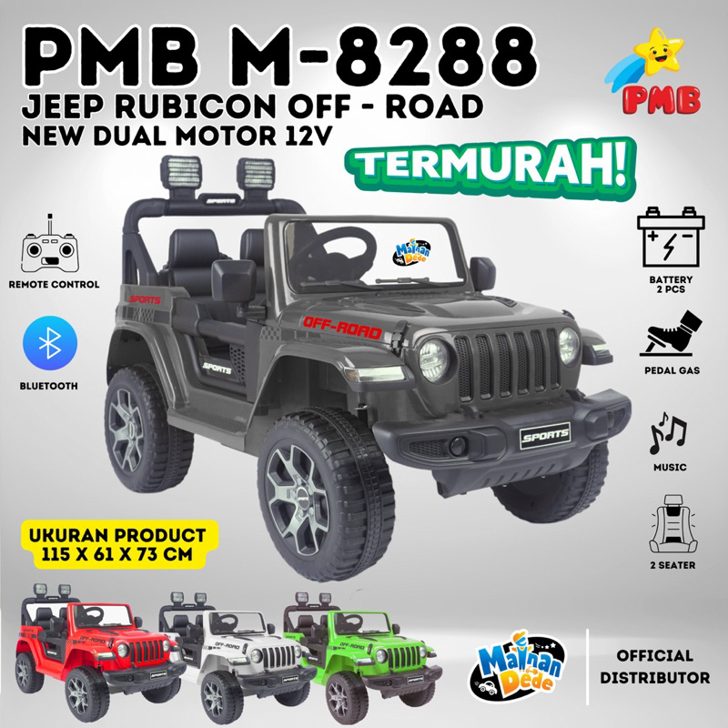
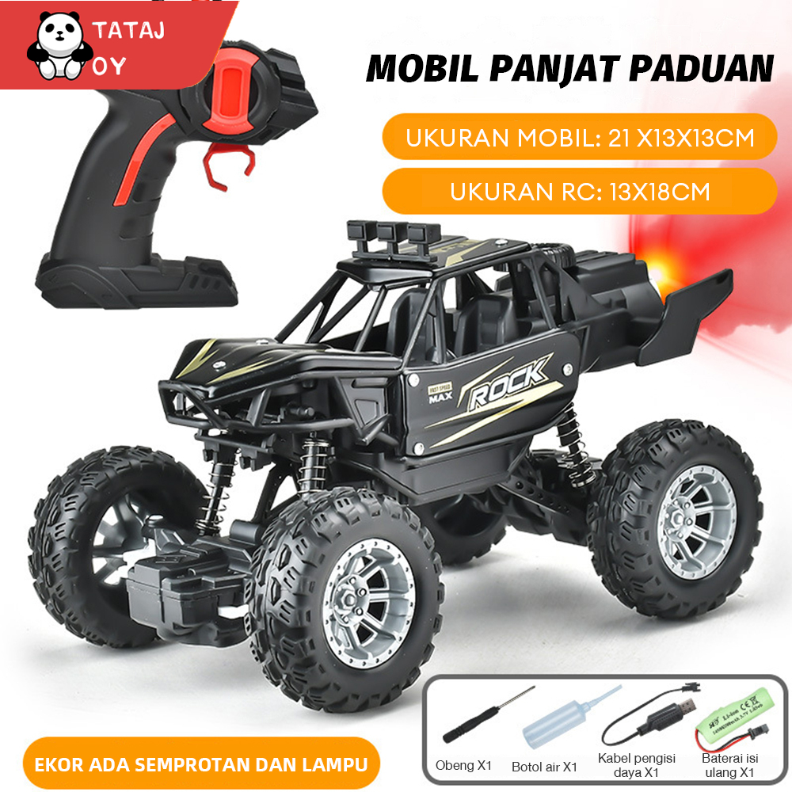
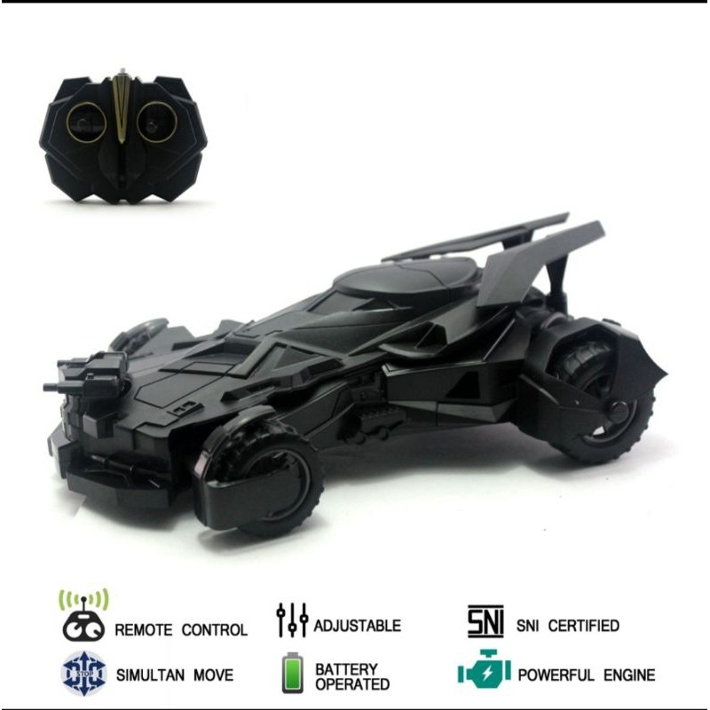

## Tampilan awal
https://akhrf.github.io/Ass_AhmadKartaNugraha/

```js
    <nav class="bg-black mt-52 mr-72 ml-72 mb-52">
    <form class="text-center bg-gray-500 p-20 rounded-lg" name="login" action="hal2.html" method="post">

        <label for="Email" class="text-black">Email Kang : </label> <br>

        <input type="email" name="email" id="email"> <br>

        <label for="Password" class="text-black">Password : </label> <br>

        <input type="password" name="password" id="password"> <br>

        <a class="underline" href="list.html"><button type="button" class="bg-black text-white rounded-lg p-1 mt-2">Login</button></a>

        <input class="underline" type="Reset" value="Hapus"/>
    </form>
    </nav>
```
## Hasilnya

disini saya membuat form untuk masuk ke tampilan list barang
## Tampilan Kedua
https://akhrf.github.io/Ass_AhmadKartaNugraha/list.html

```js
    <div>
    <section class="container mx-auto my-8 p-8 bg-white shadow-lg rounded-lg">
        <h2 class="text-3xl font-bold mb-8">Harga terbaru mobil aki dan Mobil dan mobil remote</h2>
    </div>
        <div class="grid grid-cols-1 md:grid-cols-2 gap-8">
                        <!-- Table -->
                        <div class="bg-gray-300 p-6 rounded-lg">
                            <h1 class="text-xl font-bold mb-2">List nama,tipe dan harga : </h1>
                            <p class="text-gray-700 mb-4">Berikut adalah list dari mobil remote dan mobil aki terbaru</p>
                            
                            <table border="2">
                    
                                <tr>
                                    
                                   <th>NAMA</th>
                       
                                   <th class="text-black">TIPE</th>
                       
                                   <th>HARGA</th>
                       
                                 </tr>
                       
                                 <tr>
                    
                                   <td>Jeep Rubicon OFF ROAD</td>
                       
                                   <td>PMB</td>
                       
                                   <td>Rp1.130.000 - Rp1.220.000</td>
                       
                                 </tr>
                                
                                 <tr class="text-green-600">
                       
                                   <td>Remote Control Offroad Alloy Climbing Car</td>
                       
                                   <td>C05</td>
                       
                                   <td>Rp220.000 - Rp299.000</td>
                       
                                 </tr>
                       
                                 <tr>
                    
                                   <td>REMOTE CONTROL BATMOBILE</td>
                       
                                   <td>VEHICLEM</td>
                       
                                   <td>Rp90.000</td>
                       
                           </table>
                        </div>
            <!-- Item 1 -->
            <div class="bg-gray-300 p-6 rounded-lg">
                
                <h3 class="text-xl font-bold mb-2">Jeep Rubicon OFF ROAD</h3>
                <p id="harga" class="text-gray-700 mb-4">Klik untuk mengetahui harganya</p>
                <button type="button"
                        onclick="document.getElementById('harga').innerHTML= 'Rp1.130.000 - Rp1.220.000'">Click</button>
            </div>
            <!-- Item 2 -->
            <div class="bg-gray-300 p-6 rounded-lg">
                
                <h3 class="text-xl font-bold mb-7">Remote Control Offroad Alloy Climbing Car</h3>
                <p id="hrg" class="text-gray-700 mb-4">Klik untuk mengetahui harganya</p>
                <button type="button"
                        onclick="document.getElementById('hrg').innerHTML= 'Rp220.000 - Rp299.000'">Click</button>
            </div>
            <!-- Item 3 -->
            <div class="bg-gray-300 p-6 rounded-lg">
                
                <h3 class="text-xl font-bold mb-7">Remote Control BATMOBILE</h3>
                <p id="hrga" class="text-gray-700 mb-4">Klik untuk mengetahui harganya</p>
                <button type="button"
                        onclick="document.getElementById('hrga').innerHTML= 'Rp90.000'">Click</button>
            </div>
        </div>
    </section>
```
## Hasilnya

jika saya scroll kebawah akan menampilkan nama barang,list barang,dan button untuk melihat harga