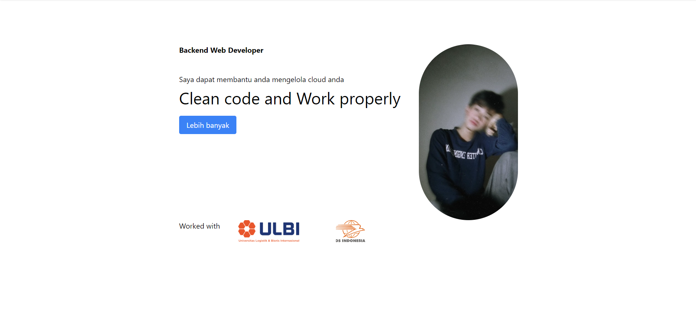

# Assesmen 1 Hadi Muhammad Yusuf

## Studi kasus
### Web Profile

# bahasa yang digunakan
1. html sebagai indexnya
2. tailwindcss untuk tampilan webnya (navbar)

Disini saya membuat website yang mendeskripsikan diri saya, Ini adalah navbar yang saya buat

Dan berikut ini adalah awal halaman website saya sebelum melakukan event dari button, Dan button tersebut menggunaknan JavaScript.

Lalu ketika button di klik maka akan merubah gambar saya menjadi card yang mendeskripsikan saya.

link CI/CD
https://zarruu.github.io/AssHadiMYsf/
