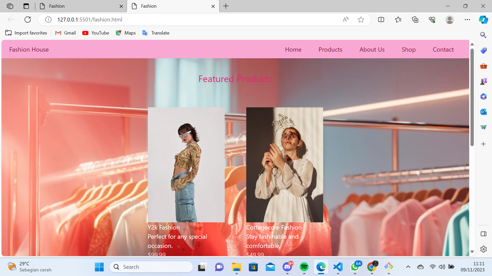
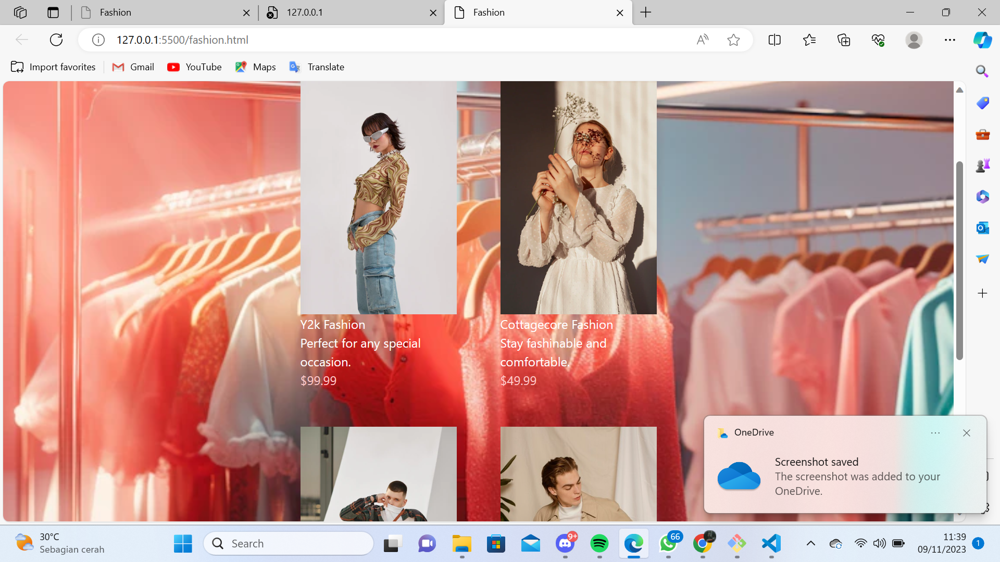
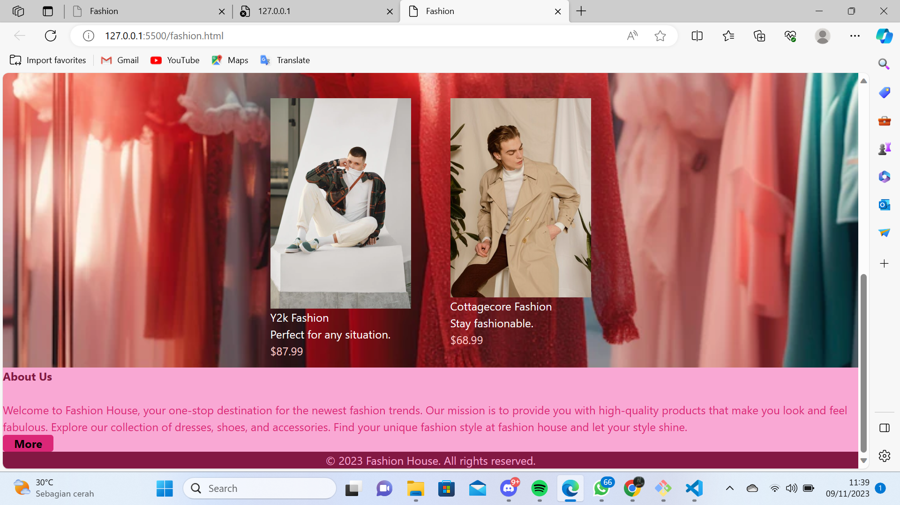
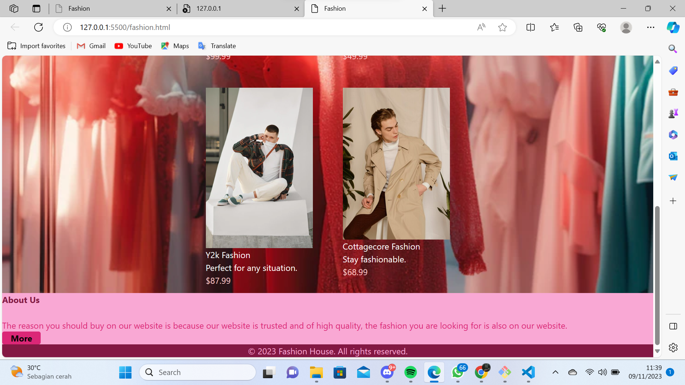
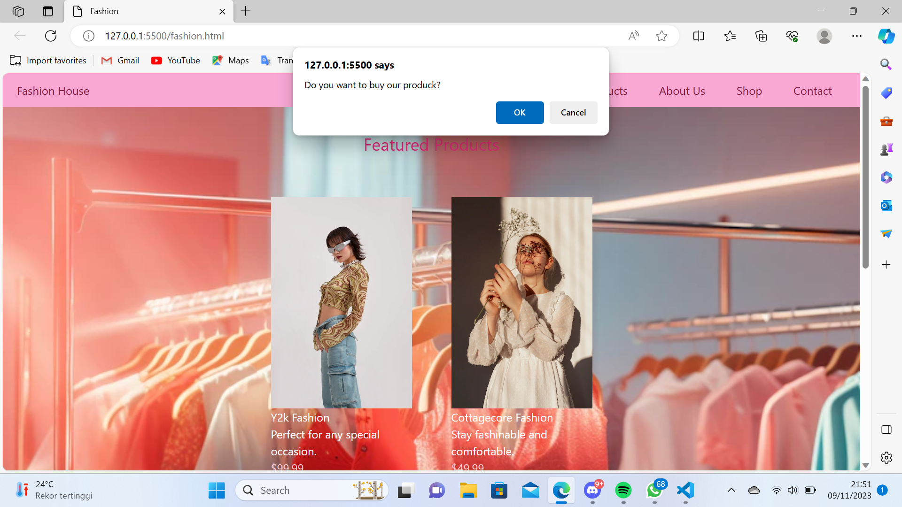
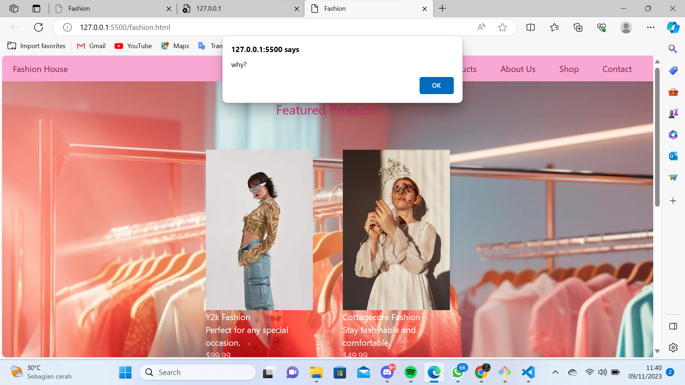

# link Website
https://nesyasal.github.io/ass_nesyasalma/

# E-commers
Website ini berisi tentang Fashion internasional sekaligus jual beli baju. Di dalam website ini saya memberikan beberapa katalog baju yang dapat di beli.

Website fashion ini saya beri nama Fashion House yang hanya berisikan satu halaman. Terdapat navbar yang berisikan Home, Product, About Us, shop dan contact. Jika user meng-klik home akan tetap berada di halaman home, lalu jika user meng-klik Produck akan dialihkan ke 4 katalog produk.

# About Us
kemudian jika meng-klik About Us website akan meng-scroll kebawah disana terdapat teks yang menjelaskan tentang website fashion kami disana juga user bisa meng-klik button more untuk mengetahui alasan mengapa harus membeli fashion di web kami.

# Shop
jika meng-klik Shop, akan muncul button dan terdapat dua pilihan. Jika user meng-klik "OK" maka akan dialihkan ke Shopee dan anda bisa berbelanja, namun jika user meng-klik cancel akan terdapat pesan baru.

# Contact
Jika User meng-klik Contact maka akan di alihkan ke WhatsApp

# Product
Product yang saya tampilkan ada dua yaitu fashion Y2k dan juga cottagecore untuk wanita juga pria disana juga saya mencantumkan harganya.

# footer
Terakhir di dalam footer saya memberikan copy right.

