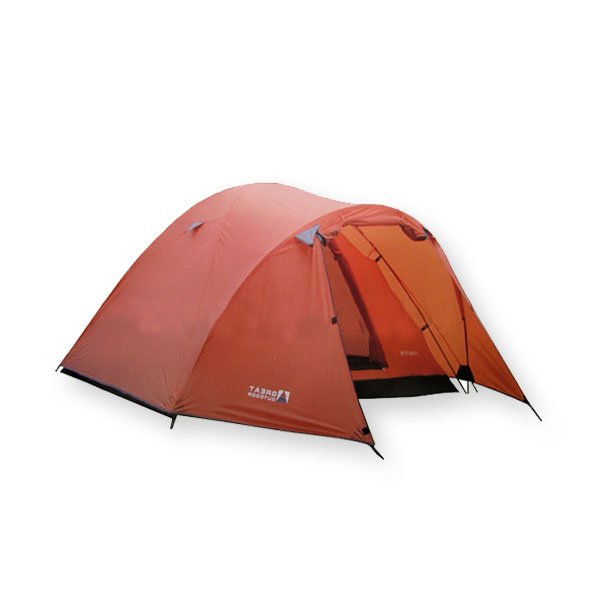
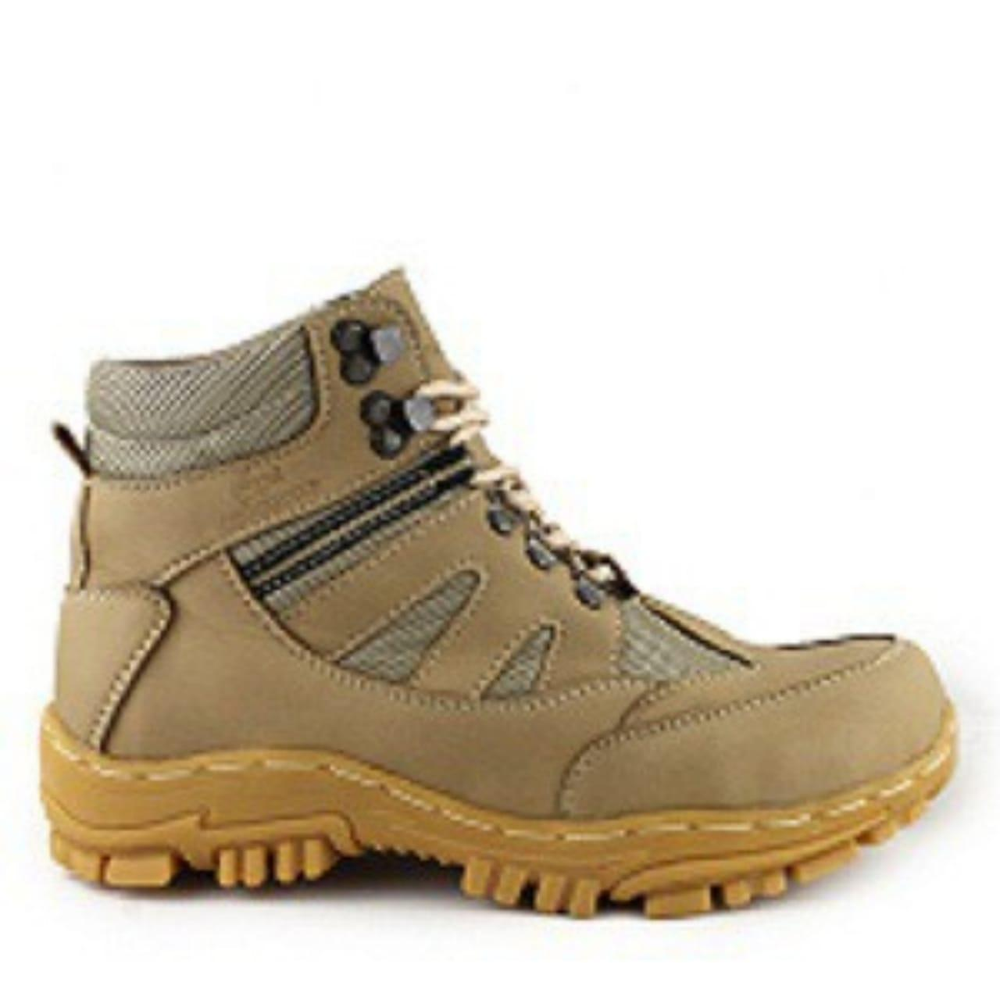

# Tugas Assesmen Rifky Najra Adipura
## Penjelasan Singkat Website Yang di Buat
Saya membuat sebuah Website sederhana dengan topik tampilan Website Penyewaan Alat Camping. Disini orang yang ingin menyewa alat-alat Camping dapat melihat barang dan harganya.

## Link Website
https://rifkyadipura.github.io/Ass_RifkyNajraAdipura/

## 1. Tampilan awal
``` js
<nav class="bg-purple-700 text-white py-4">
        <div class="container mx-auto flex justify-between items-center">
            <a href="#" class="text-2xl font-bold">Mountain</a>
            <ul class="flex space-x-4">
                <li><a href="https://api.whatsapp.com/send?phone=089657140789" class="hover:underline">Hubungi</a></li>
            </ul>
        </div>
    </nav>

    <!-- Hero section -->
    <section class="h-screen flex items-center justify-center bg-[url('img/Gunung.jpeg')] bg-cover bg-center bg-repeat text-white">
        <div>
            <div class="container mx-auto text-center">
                <h1 class="text-5xl font-bold mb-4 my-10">Selamat Datang Di Website Penyewaan Tenda alat Camping</h1>
                <p class="text-lg" id="text">Temukan Barang Yang Ingin anda gunakan.</p>
                </button>
            </div>
        </div>
    </section>
```
## Hasilnya


## 2. Tampilan barang alat
jika di scroll ke bawah akan langsung menampilkan barang
``` js
<!-- Bagian Alat -->
    <section class="container mx-auto my-8 p-8 bg-white shadow-lg rounded-lg">
        <h2 class="text-3xl font-bold mb-8">Macam-Macam Barang</h2>
        <div class="grid grid-cols-1 md:grid-cols-2 gap-8">
            <!-- Barang ke 1 -->
            <div class="bg-gray-200 p-6 rounded-lg">
                
                <h3 class="text-xl font-bold mb-2">Tenda</h3>
                <p class="text-gray-700 mb-4">Tenda kapasitas 6 orang</p><br>
                <p class="text-gray-700 mb-4" id="cekhargatenda"></p>

                <!-- Penggantian Paragraf dari Button -->
                <button class="my-8 bg-blue-500 hover:bg-blue-700 text-white font-bold py-2 px-4 rounded focus:outline-none focus:shadow-outline" 
                type="button" onclick='document.getElementById("cekhargatenda").innerHTML = "Harga Tenda ke 1 400k/hari <br> Harga Tenda Ke 2 600k/hari"'>
                    Cek Harga
                </button>

                <!-- Image Change -->
                <button class="my-8 bg-blue-500 hover:bg-blue-700 text-white font-bold py-2 px-4 rounded focus:outline-none focus:shadow-outline" type="button" onclick="document.getElementById('fototenda').src='img/tenda2.jpeg'">
                    Ganti Tenda
                </button>
                
                <!-- Button -->
                <button onclick="penjualtenda()" class="my-8 bg-blue-500 hover:bg-blue-700 text-white font-bold py-2 px-4 rounded focus:outline-none focus:shadow-outline">Hubungi Penjual</button>
                    <script>
                        function penjualtenda() {
                            alert("Hubungi Pemilik");
                            window.open("https://api.whatsapp.com/send?phone=089657140789");
                        }
                    </script>
            </div>
            <!-- Alat ke 2 -->
            <div class="bg-gray-200 p-6 rounded-lg">
                
                <h3 class="text-xl font-bold mb-7">Sepatu</h3>
                <p class="text-gray-700 mb-4">Sepatu Gunung Terbaik</p>
                <p class="text-gray-700 mb-4" id="cekhargasepatu"></p>

                <!-- Penggantian Paragraf dari Button -->
                <button class="my-8 bg-blue-500 hover:bg-blue-700 text-white font-bold py-2 px-4 rounded focus:outline-none focus:shadow-outline" 
                type="button" onclick='document.getElementById("cekhargasepatu").innerHTML = "Harga Sepatu ke 1 200k/hari <br> Harga Tenda Ke 2 300k/hari"'>
                    Cek Harga
                </button>
                <!-- Image Change -->
                <button class="my-8 bg-blue-500 hover:bg-blue-700 text-white font-bold py-2 px-4 rounded focus:outline-none focus:shadow-outline" 
                type="button" onclick="document.getElementById('fotosepatu').src='img/sepatu2.jpeg'">
                    Ganti Sepatu
                </button>

                <!-- Button -->
                <button onclick="penjualsepatu()" class="my-8 bg-blue-500 hover:bg-blue-700 text-white font-bold py-2 px-4 rounded focus:outline-none focus:shadow-outline">Baca Selengkapnya</button>
                    <script>
                        function penjualsepatu() {
                            alert("Hubungi Pemilik");
                            window.open("https://api.whatsapp.com/send?phone=089657140789");
                        }
                    </script>
            </div>
        </div>
    </section>
```
## Hasilnya


## 3. Cek harga Barang
jika di klik akan menampilkan harga sewa permalam
``` js
<!-- cek harga tenda -->
<p class="text-gray-700 mb-4" id="cekhargatenda"></p>

                <!-- Penggantian Paragraf dari Button -->
                <button class="my-8 bg-blue-500 hover:bg-blue-700 text-white font-bold py-2 px-4 rounded focus:outline-none focus:shadow-outline" 
                type="button" onclick='document.getElementById("cekhargatenda").innerHTML = "Harga Tenda ke 1 400k/hari <br> Harga Tenda Ke 2 600k/hari"'>
                    Cek Harga
                </button>
```
``` js
<!-- cek harga sepatu -->
<p class="text-gray-700 mb-4" id="cekhargasepatu"></p>

                <!-- Penggantian Paragraf dari Button -->
                <button class="my-8 bg-blue-500 hover:bg-blue-700 text-white font-bold py-2 px-4 rounded focus:outline-none focus:shadow-outline" 
                type="button" onclick='document.getElementById("cekhargasepatu").innerHTML = "Harga Sepatu ke 1 200k/hari <br> Harga Tenda Ke 2 300k/hari"'>
                    Cek Harga
                </button>
```
## Hasilnya


## 4. Ganti Gambar Tenda & Sepatu
Jika diklik Akan Mengganti gambar Tenda & Sepatu
``` js
<!-- ganti gambar tenda -->

<!-- Image Change -->
                <button class="my-8 bg-blue-500 hover:bg-blue-700 text-white font-bold py-2 px-4 rounded focus:outline-none focus:shadow-outline" type="button" onclick="document.getElementById('fototenda').src='img/tenda2.jpeg'">
                    Ganti Tenda
                </button>
```
``` js
<!-- ganti gambar sepatu -->

<!-- Image Change -->
                <button class="my-8 bg-blue-500 hover:bg-blue-700 text-white font-bold py-2 px-4 rounded focus:outline-none focus:shadow-outline" 
                type="button" onclick="document.getElementById('fotosepatu').src='img/sepatu2.jpeg'">
                    Ganti Sepatu
                </button>
```
## Hasilnya


## 5. Hubungi Penjual
Untuk Hubungi Penjual akan di alihkan ke dalam Whatsapp pemilik penyedia alat barang untuk camping
``` js
<!-- Button -->
                <button onclick="penjualtenda()" class="my-8 bg-blue-500 hover:bg-blue-700 text-white font-bold py-2 px-4 rounded focus:outline-none focus:shadow-outline">Hubungi Penjual</button>
                    <script>
                        function penjualtenda() {
                            alert("Hubungi Pemilik");
                            window.open("https://api.whatsapp.com/send?phone=089657140789");
                        }
                    </script>
```
## Hasilnya


## 6. Move to whatsapp
## Hasilnya

