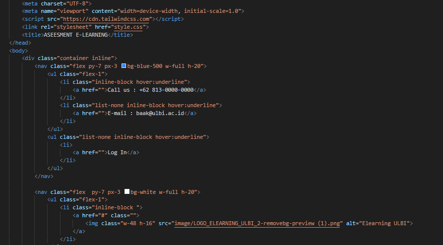
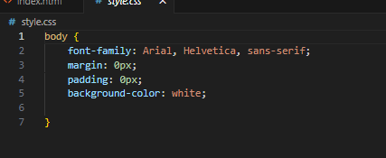
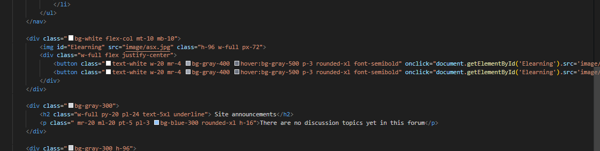
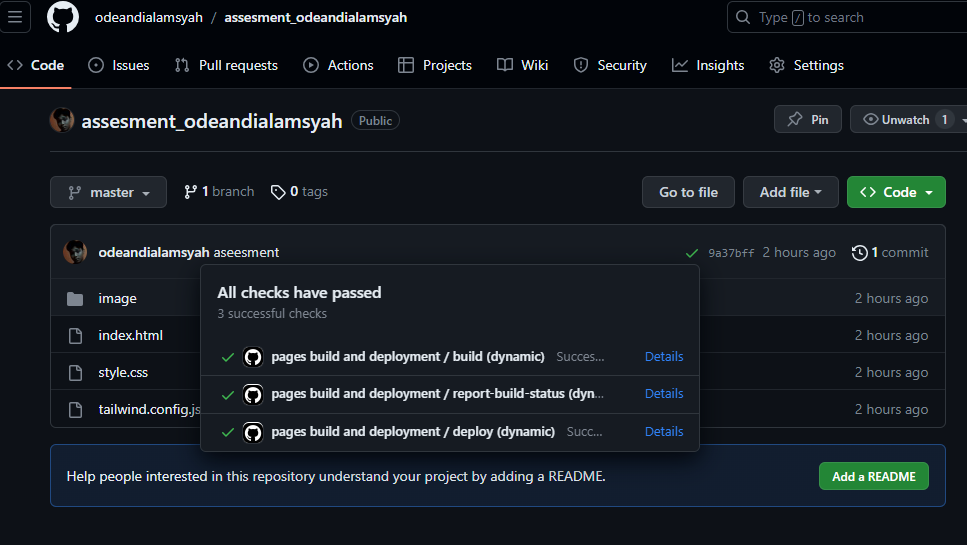
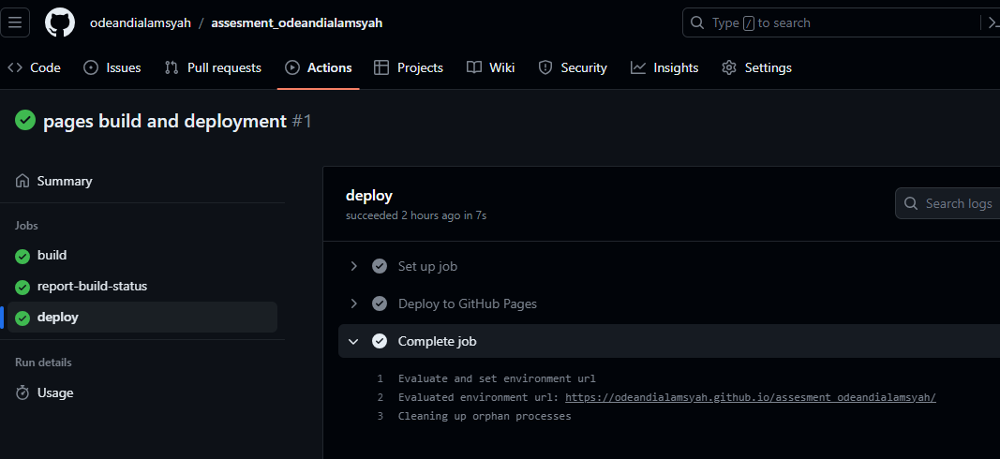
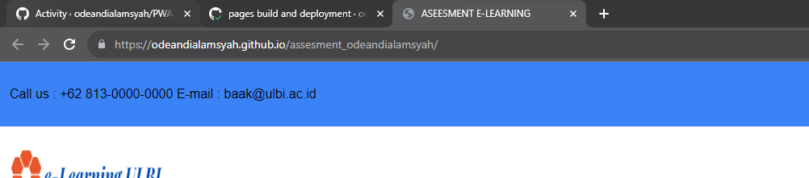

# Tugas assesement dgn topik E-leaarning

saya menggunakan web E-learning ULBI sebagai referensi dan patokan tampilan.
https://odeandialamsyah.github.io/assesment_odeandialamsyah/

## tailwind internal dan html

##

## java script

## CI/CD

